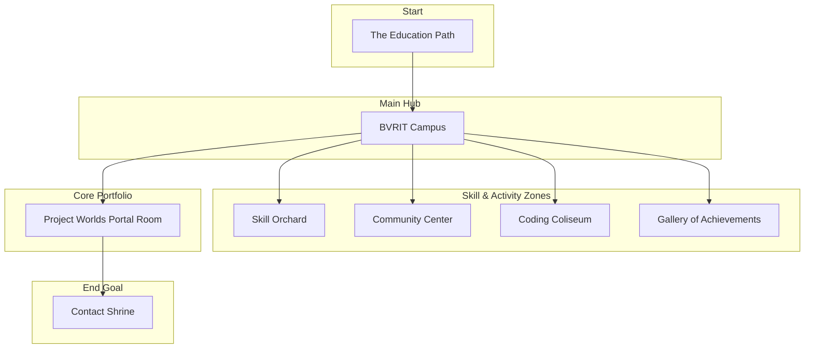

# Gnanika's Interactive Portfolio: Game Plan

## 1. Overview

This document outlines the plan for creating an interactive, game-based portfolio for Gnanika Makkena. The project will take the form of a 2D RPG-style adventure game where the user (player) explores a world representing Gnanika's skills, projects, and experiences.

---

## 2. Technology Stack

*   **Core:** HTML, CSS, and vanilla JavaScript.
*   **Rendering:** All graphics, animations, and game logic will be managed through JavaScript interacting with the HTML `<canvas>` element.
*   **Note on Libraries:** While the goal is to use vanilla JavaScript, we might consider a micro-library like **Kaboom.js** later if low-level canvas management becomes too complex. Kaboom is still JavaScript and works within the same environment, but simplifies game-specific tasks like sprite animation and collision detection. We will start without it and evaluate later.

---

## 3. Visual Style

*   **Aesthetic:** Classic 16-bit Pixel Art.
*   **Inspiration:** Games like *The Legend of Zelda: A Link to the Past* and *Stardew Valley*.
*   **Color Palette:** Vibrant and engaging, but with clear distinctions between different zones.
*   **UI:** Pixelated fonts, simple 9-slice borders for dialogue boxes and menus.

---

## 4. World Map Layout

The world will be a single, explorable map connecting all the different zones. The player will be guided through the zones in a logical progression.



---

## 5. Zone Breakdowns

### 5.1. The Education Path (Start Zone)
*   **Purpose:** Showcase Gnanika's academic journey.
*   **Gameplay:** The player starts here and follows a linear path through three key locations.
*   **Content & UI:**
    1.  **International School of Benghazi (ISB):** First location. An interactive signpost reads: *"My journey began here with my IGCSE. Fun fact: I achieved the highest grades in the institute's history!"*
    2.  **NIOS (National Institute of Open Schooling):** A second signpost: *"I completed my Senior Secondary education through NIOS."*
    3.  **BVRIT Hyderabad:** The path leads into the main hub of the game world.

### 5.2. BVRIT Campus (Main Hub)
*   **Purpose:** Act as the central area connecting all other zones.
*   **Gameplay:** Open, explorable area with paths leading to the different zones. An NPC near the entrance will provide a welcome and basic instructions.

### 5.3. The Skill Orchard
*   **Purpose:** Display technical skills.
*   **Gameplay:** A beautiful garden area. The player can walk up to glowing "skill crystals" and press 'E' to "collect" them.
*   **Content & UI:** Each crystal represents a skill (Java, Python, C, Flutter, HTML, CSS, JS, React, Node.js, etc.). When collected, a clean pop-up modal appears with the skill's name and a brief description of Gnanika's experience with it.

### 5.4. The Community Center
*   **Purpose:** Highlight extracurricular activities and soft skills.
*   **Gameplay:** A building with two rooms.
*   **Diagram:**
    ```mermaid
    graph TD
        A[Community Center Entrance] --> B[Toastmasters Room]
        A --> C[COPE Room]
    ```
*   **Content & UI:**
    *   **Toastmasters Room:** An NPC mentions the **VP Membership** role. A silver trophy on a pedestal can be interacted with to show: *"Master Orator Championship - 1st Runner Up"*.
    *   **COPE Room:** An NPC or a framed certificate on the wall details the **Certified Mental Health First Aider** role.

### 5.5. The Coding Coliseum
*   **Purpose:** A dedicated section for competitive programming achievements.
*   **Gameplay:** An impressive arena building. Inside, two large, interactive statues.
*   **Content & UI:**
    *   **LeetCode Statue:** Interacting brings up a modal: **"LeetCode Guardian | 900+ Problems Solved | 40+ Contests."**
    *   **Codeforces Statue:** Interacting brings up a modal: **"Codeforces Specialist | 20+ Contests."**

### 5.6. The Project Worlds (Portal Room)
*   **Purpose:** The core of the portfolio, showcasing projects in an interactive way.
*   **Gameplay:** A high-tech room with several portals. Entering a portal starts a unique mini-level.
*   **Diagram:**
    ```mermaid
    graph TD
        subgraph "Project Portals"
            A(MentorMatch.ai)
            B(Slotify)
            C(FundFlock)
            D(MasterWord)
            E(Operion)
            F(Birthday Mailer)
        end
    ```
*   **Mini-Level Concepts:**
    *   **MentorMatch.ai:** A simple quest to match an NPC student to the correct NPC mentor based on their descriptions.
    *   **Slotify:** A time-based puzzle to arrange a conflict-free schedule on a small grid.
    *   **FundFlock:** Collect coins from 3-4 NPCs and deposit them in a central "fund."
    *   **MasterWord:** A simple, 3-letter version of Wordle.
    *   **Operion:** A room where the player can press buttons to change the room's lighting and music ("Work Mode," "Chill Mode").
    *   **Birthday Mailer:** A simple fetch quest to deliver a letter from one NPC to another.

### 5.7. The Gallery of Achievements
*   **Purpose:** Showcase other significant achievements.
*   **Gameplay:** A grand hall with trophies on pedestals. Interacting with each reveals details.
*   **Content:**
    *   LinkedIn Coachin Hackathon (3rd Place)
    *   LinkedIn Coachin Mentee
    *   Google Student Upskilling LaunchPad
    *   DESIS Ascend Educare Mentee

### 5.8. The Contact Shrine
*   **Purpose:** The call to action - providing contact/professional links.
*   **Gameplay:** The final area. A serene shrine or monument with four interactive pedestals.
*   **Content & UI:** Each pedestal will be marked with a pixel-art icon (GitHub, LinkedIn, LeetCode, Email) and will open the corresponding link in a new tab when activated.

---

## 6. UI/UX Elements

*   **Player Character:** A simple, 4-direction animated pixel-art sprite.
*   **Interaction:** When near an interactive object, a small "E" key icon will appear above it.
*   **Dialogue/Info Box:** A standard RPG-style text box at the bottom of the screen with a pixelated border and typewriter effect for the text.
*   **Modals:** For detailed information (skills, achievements), a centered pop-up box will appear, pausing the game.

---

## 7. Initial Asset List

*   **Sprites:**
    *   Player Character (walk animations for 4 directions)
    *   Generic NPCs (at least 2-3 variations)
*   **Tileset:**
    *   Grass, Path, Water, Trees, Flowers
    *   Interior floors and walls
*   **Objects:**
    *   Buildings (for campus, community center, etc.)
    *   Portals (animated)
    *   Statues, Pedestals, Trophies
    *   Skill Crystals (glowing)
    *   Signs, certificates
*   **UI:**
    *   Dialogue box border
    *   Modal window border
    *   Pixelated Font
    *   Interaction icon ('E')

This plan will serve as our blueprint for development.
